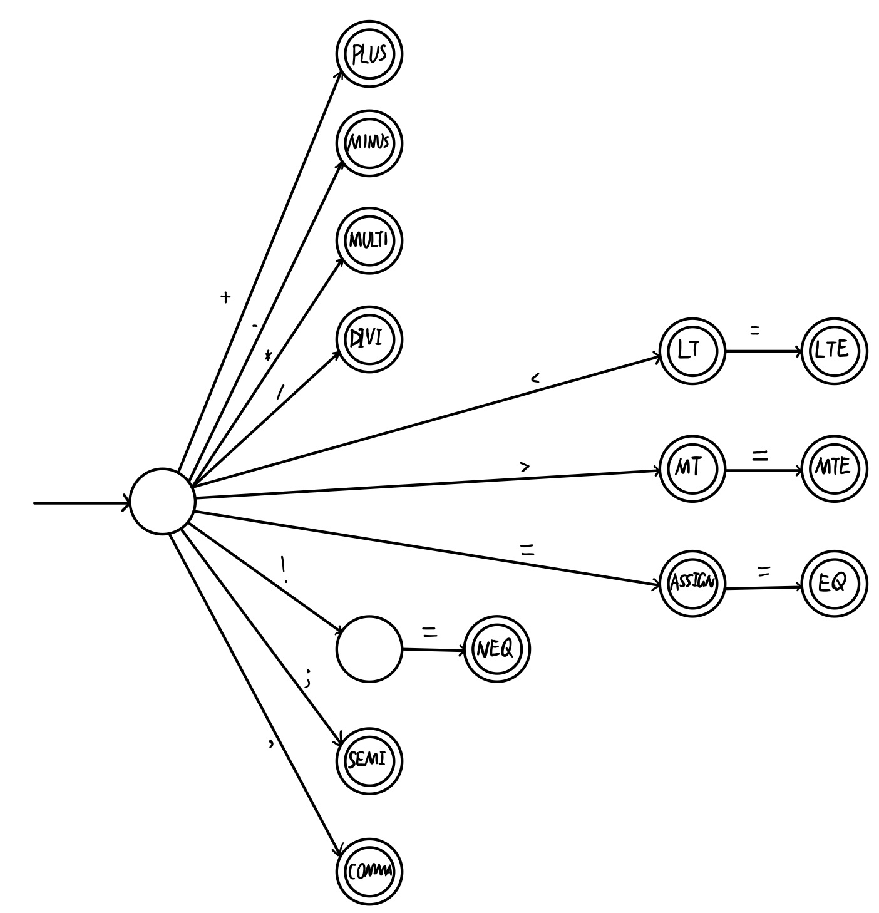
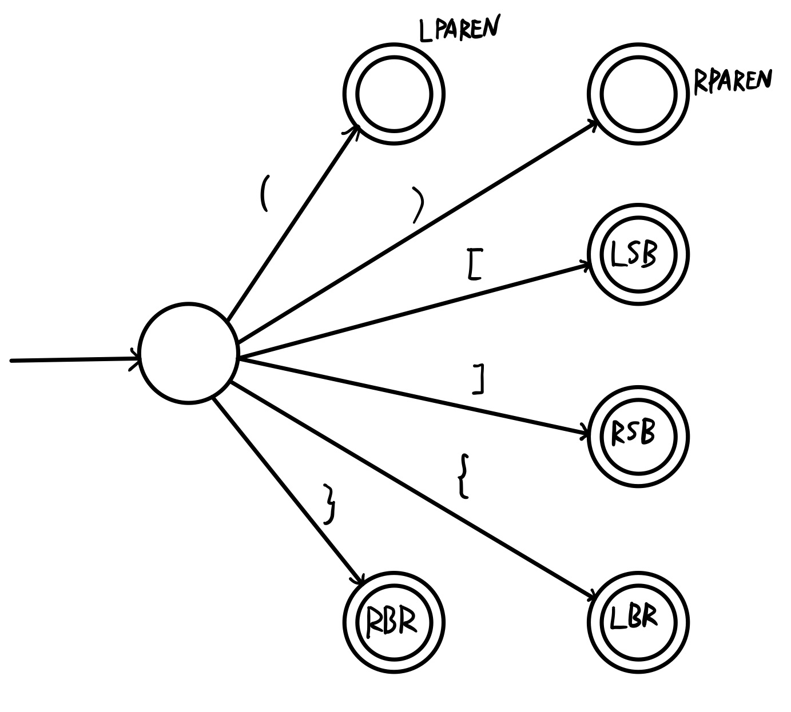
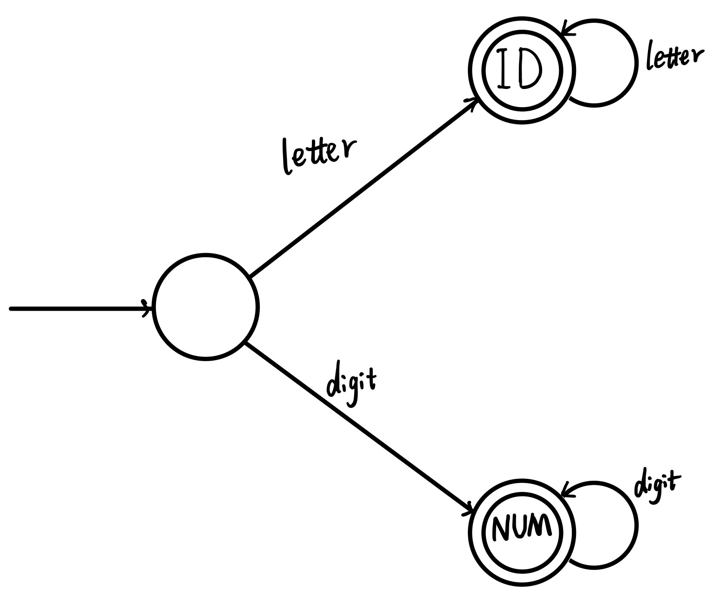
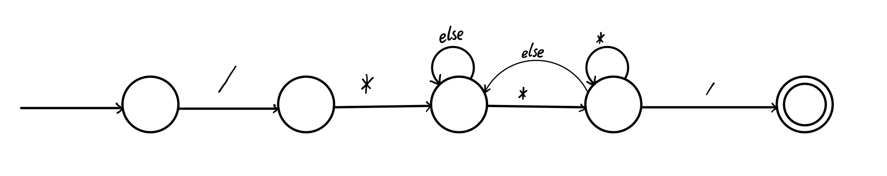
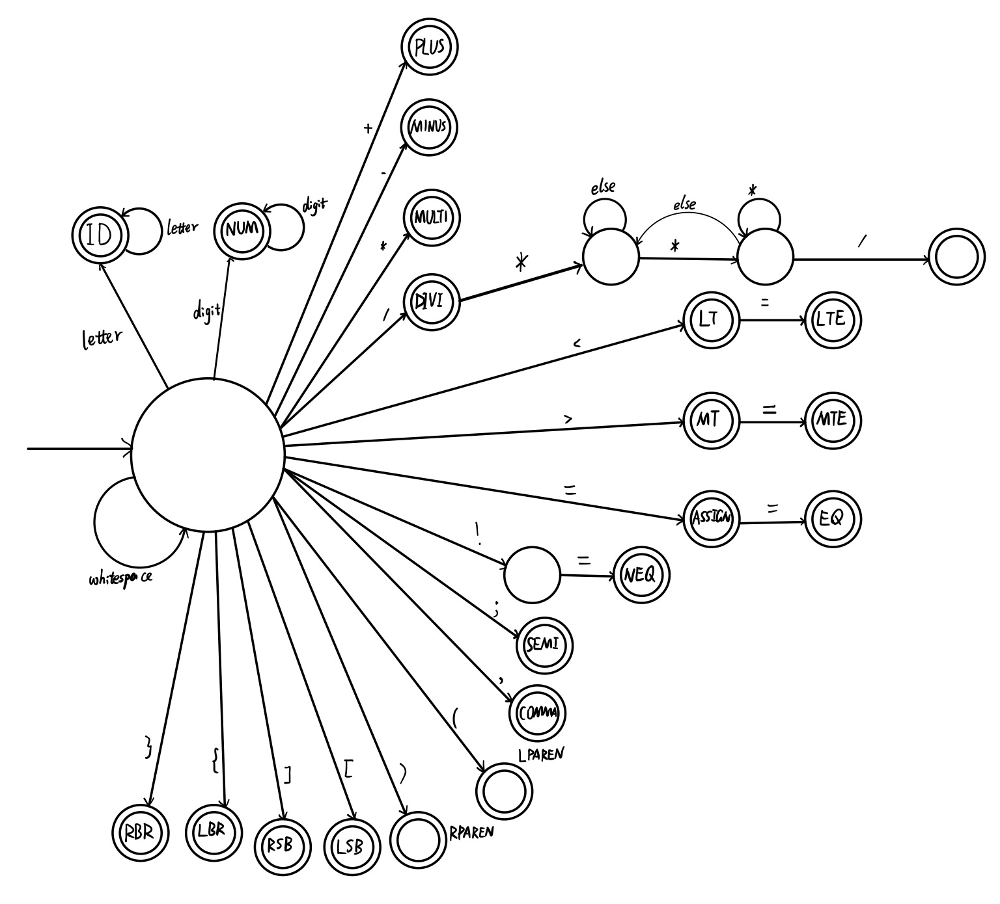
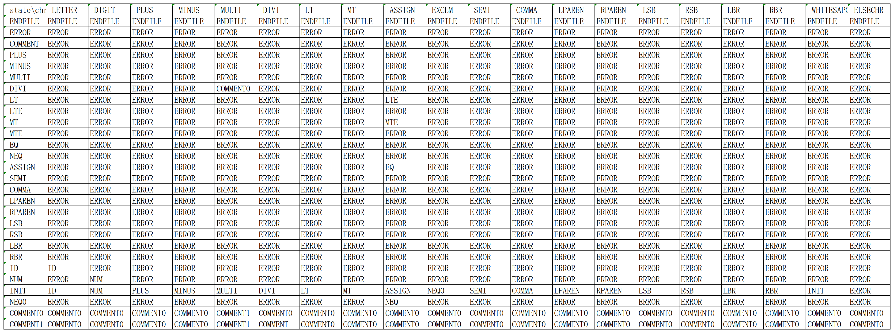

2019.10.10

# 扫描器部分

扫描器部分的设计主要关注C-Minus的词法, x部分待定.  整体思路是先根据本语言的词法进行DFA的构造, 再用算法对DFA进行描述. 最后用程序实现一个可以将源代码文件通过该算法识别其中记号的项目. 

## 语言词法:

1. 下面是语言的关键字:
    `else if int return void while`
    所有的关键字都是保留字, 并且必须是小写. 

2. 下面是专用符号:
    `+ - * / < <= > >= == != = ; , ( ) [ ] { } /* */ `

3. 其他标记是*ID*和*NUM*, 通过下列正则表达式定义:

    ```
      ID = letter letter*
      NUM = digit digit*
      letter = a|..|z|A|..|Z
      digit = 0|..|9
    ```

      小写和大写字母是有区别的.

4. 空格由空白, 换行符和制表符组成. 空格通常被忽略, 除了它必须分开 ID, NUM关 键字.

5. 注释用通常的C语言符号/ * . . . * /围起来. 注释可以放在任何空白出现的位置 (即注释 不能放在标记内)上, 且可以超过一行. 注释不能嵌套. 


## 确定性有穷状态自动机(DFA)的构造:

根据已经列出的词法规则, 可以分几个部分设计出对应的DFA, 然后将其综合起来得到整体的DFA. 
对于关键字的处理, 暂且采用和教材一样的方案, 将其作为标识符来识别, 然后对标识符检测是否在关键字列表中, 因此, DFA的构造就不包括关键字部分了. 此外, 考虑到本语言的词法并不十分复杂, 因此扫描程序使用的DFA无需通过先生成NFA, 再通过子集构造的步骤生成DFA, 而是可以直接写出. 

### 1. 专用符号

专用符号中, 除了注释使用的`/*...*/`符号, 其他的符号不应该被略去, 因此, DFA如下:




为了方便绘图将其分为两个部分. 

### 2. 标识符(ID)和数字(NUM)




### 3. 注释

注释的识别不是为了生成记号, 而是为了从源文件中剔除, 或者说使其不影响后续步骤. 



### 4. 合并



至此, DFA已经初步构造完成, 没有在其中表示注释的位置标出来是为了与其他真正可以得到记号的接受状态区分开来.  


## 算法的选择:

根据DFA构造扫描程序有两种思路是可行的, 一种是使用**switch**语句嵌套的方式将转化函数的各种输入输出对应表示出来, 另一种思路是使用**表驱动**的方式, 用状态与字母表构造数据结构, 用数据结构来表示状态的转化. 

第一种方法的优点是思路清晰, 易于编写, 且空间利用率比较高, 运行速度也比较快. 缺点也很明显, 即结构不够条理化, **拓展性不是很好**. 
第二种方法的优点是结构简单清晰, 代码**拓展性比较强**, 缺点是空间利用率较差, 如果使用其他算法优化空间利用率则会造成性能下降. 
考虑到项目在后续过程中**可能会添加新的特性, 造成词法的更新**, 对代码的拓展性有一定要求, 并且本工程的目的在于学习而不是真正的使用, **对于空间利用率的要求不是很高**, 在这种情况下, 表驱动并**不会**带来性能上太大的下降. 综合各方面因素, 决定使用表驱动的算法来设计编写扫描器代码. 


## 程序设计:

### 功能与结构分析:

首先需要明确的是, 扫描器的任务是从源代码文件中扫描出所有的记号以及所需的附属信息, 而从应用角度出发实际上需要设计的是一个可以从当前位置得到下一个记号以及其附属信息的模块. 这样不断调用该模块至文件结尾就可以得到每一个记号. 除此之外, 为方便调试与修改, 还应该在程序的适当位置加入打印信息的功能. 比如将程序逐行打印并且在前边加上行号, 并在输出的每一行下边列出改行的记号. 程序的大体步骤应该包括以下部分:

1.  **根据用户输入的文件名, 对文件内容进行读取.**
   
   文件句柄应该设置为所有文件共享的变量, 原因是扫描器的各个模块可能在整个编译过程中的后续步骤中被调用, 而扫描器必须在文件打开的状态下才能工作, 为了不频繁打开关闭文件, 最好的办法是让文件在编译的整个过程中保持打开, 在编译过程结束后再关闭. 而这样的策略就要求文件句柄必须是一个(所有文件的)全局变量.  
   
2. **实现逐个字符读取的功能.**

   根据DFA的特点, 扫描器应该是不断逐个地读取字符从而构造记号. 因此获取下一个字符这一操作必然会被频繁使用, 理所当然地应该将其模块化为函数. 文件已经在扫描模块外部打开, 所以本功能的实现就是当读取指针到达缓冲区末尾时, 从文件中读取一行更新缓冲区, 并将缓冲区第一个字符存入变量. 而当缓冲区不为空时, 则直接根据读取指针读取一个字符存入变量, 并**视情况**将读取指针移到下一个位置.

3. **根据状态转化表, 读取记号并打印记号.**

   状态转换表的构造在下文中详细说明, 构造好状态转换表后, 根据当前的状态和下一个字符, 就可以确定下一个状态, 只需对接受状态进行判断就可以得到记号. 关于记号应该定义一个通用的数据结构(类)来表示以及存储, 而记号类型和记号的串值已经可以完全定义一个记号. 根据读取的字符以及根据**最长子串原理**确定的最终的接受状态, 就可以构造这两个属性. 考虑到打印的需求, 在构造好一个记号后, 应该将其打印出来. 


### 状态转换表:

根据DFA, 可以构造出转换表的数据结构. 转换表是一个二维表, 其中一个维度是字母表中的字符, 另一个维度是当前状态. 其中, 接受状态与记号其实是对应的, 在前边的DFA图中, 标出的接受状态就对应了各种记号. 因此还需要总结一下非接受状态, 并将其综合在一起形成状态集合, 可以设定为枚举类型. 

转换表是一个二维表, 其中一个维度是字母表中的字符, 另一个维度是当前状态. 

接下来考虑字母表, 字母表作为状态转换函数中自变量的一个分量, 不同的字母是应该区分开的, 但是在转换表中, 没有必要将所有情况列出, 以标识符为例, 无论读入哪一个英文字母, 状态转换过程是完全相同的, 因此, 如果将`letter`作为"字母表"中的一个"字母", 则先调用函数对字符进行判断, 如果是英文字母就归为letter, 这样做可以很大程度上简化转换表. 

生成转换表的项目是`BuildTransion`. 

转换表如下: 
[transion1.xlsx](scanner.assets\transion1.xlsx) 或


### 扫描过程:

只有状态转换表还不够, 整个扫描过程至少还有三个部分需要考虑.

1. **从读入字符到字母表中字母的转换.**
   
   在构造转换表时就已经说明, 从读入的字符并不能直接得到字母表中的字母, 必须进行一定的处理才能输入转换表得到输出. 不仅要对输入的字符进行归并, 形成`letter, digit, whitespace`, 而且还要注意字符到枚举类型的处理. 

2. **接受状态的识别.**

   当前的状态其实分为三种, **非接受状态, 接受状态, 与错误状态**, 初始状态`INIT`包含在非接受状态中. 而只有前两种状态才会继续根据状态转换函数进行转换, 状态转换函数根据当前的字符和当前的状态得到下一个状态的情况有以下几种:

   | 当前状态\下个状态 | 错误                                       | 接受状态 | 非接受状态 |
   | ----------------- | ------------------------------------------ | -------- | ---------- |
   | 接受状态          | 生成记号, 等待下一次调用                   | 继续读取 | 继续读取   |
   | 非接受状态        | 生成错误信息,将当前状态置为`INIT`,重新开始 | 继续读取 | 继续读取   |

   该表说明了不同情况下, 程序下一步应该执行的操作. 可以看出, 无论是什么状态, 只要根据转换表得到的状态不是`ERROR`和`ENDFILE`, 就继续读取下一个字符, 而如果根据转换表得到了`ERROR`和`ENDFILE`, 那么**当前状态是否是接受状态**就十分关键了, 如果是接受状态, 那么意味着成功生成了一个记号, 而如果不是接受状态, 不仅没有记号, 还需要生成错误信息. 因此, 可以设计一个数组来保存各种状态的类型, 通过查看该数组确定当前状态的类型.
   除此之外要考虑错误信息的生成, 在字母表中有一个特殊的字母叫做`ELSECHR`, 这个字母的意思是代码中不应在任何地方出现的字符, 如果是因为这样的字符而出现错误, 那么扫描程序应该将其略过, 或者仅仅将其打印出来. 但如果出现错误的原因不是这样的字符, 那么说明该字符有可能是下一个记号的首位, 这种情况下当然应该将其保留.

3. **识别保留字(实现从接受状态到记号的转换).**

   在构造DFA时已经说明, 在识别出标识符后才识别保留字, 因此, DFA中没有保留字的构造, 相应地转换表中当然也没有. 而根据转换表识别出"标识符"后, 就需要进行是否是保留字的判断. 为此, 可以将保留字以英文字母表的顺序存入一个列表, 并对符合长度要求的"标识符"进行二分查找, 如果命中, 则判定为保留字. 否则才是真正的标识符. 事实上，该模块可以设计为从所有接受状态到所有记号类型的转换的实现. 

将三个部分的功能实现之后, 整个工程就基本完成了. 

**程序实现过程中的其他问题：**

1. 对换行符的处理
   语言的词法要求换行符是`\n`, 但是, 由于操作系统的原因, 在源文件中可能出现`\r`, 这种字符, 因此, 对于换行符的识别, 使用c++语言中的行读取函数完成, 而不管源文件中的换行符到底是什么, 都将其视为`\n`, 即, 在一行字符处理完之后, 将`nextChr`设置为`\n`, 转化为字母表中的字母, 就是`whitespace`. 在获取下一个字符的过程中, 
   判断指针到达行尾+1的位置再读取新行, 即可实现对换行符的处理. 
2. 错误字符的处理
   本语言的词法不允许某些字符出现在源代码文件中, 当识别到这些字符时, 将其归并到字母表中一个`ELSECHAR`的字母中, 并将其输出, 并视为读入了一个分隔符, 如果之前就是接受状态, 就得到一个记号, 如果不是, 将输出未完成识别的"记号". 
   而如果读入的字符不是`ELSECHAR`, 出错的原因只是不适用于当前的非接受状态, 这种情况下已经说明需要回溯, 而未完成识别的"记号"在这种情况下也需要输出. 在这里需要说明, 由于DFA中的非接受状态其实只有`INIT`和`NEQ0`, 而对`INIT`来说, 除了`ELSECHAR`之外的字符都不会引起出错, 因此只需考虑`NEQ0`, 这种状态下只要下一个字符不是`=` 就会出错, 这时应该将已输入的`!`输出并提示为未完成的"记号", 然后回溯, 从下一个字符开始重新开始识别记号. 
3. (其他待补充)

扫描器的的功能由文件`scanner.cpp`实现, 头文件是`scanner.h`, 测试语句在主程序中. 


## 程序测试:

对于设计好的程序需要对各种情况进行测试. 词法分析程序仅识别记号, 关于测试一般包括两个方面. 一是源文件符合词法规定, 在这种情况下应该设计源代码中字符排列的各种情况来测试. 二是源文件中有词法错误, 应该尽量列出所有的错误情况, 并观察扫描程序对错误情况的输出是否符合常理. 

1. **正确情况**
   
   在同一个文件中测试一下空白符很多或者没有空白符的情况, 源代码如下:

   ```c
   int gcd (int u, int v)
   { if (v == 
   0) return
    u 
   ;
   else return gcd(v,u-u/v*v);
   /* u-u/v*v == 
   u mod v */
   }
   
   
   void main(void)
   { int x; int y;
   x = input(); y = input();
   output(gcd( x , y ));
   }
   
   
   ```
   
   扫描信息如下：
   
   ```
   1: int gcd (int u, int v)
   	1: reserved word--int
   	1: identifier, name=gcd
   	1: (
   	1: reserved word--int
   	1: identifier, name=u
   	1: ,
   	1: reserved word--int
   	1: identifier, name=v
   	1: )
   2: { if (v == 
   	2: {
   	2: reserved word--if
   	2: (
   	2: identifier, name=v
   	2: ==
   3: 0) return
   	3: number, value=0
   	3: )
   	3: reserved word--return
   4:  u 
   	4: identifier, name=u
   5: ;
   	5: ;
   6: else return gcd(v,u-u/v*v);
   	6: reserved word--else
   	6: reserved word--return
   	6: identifier, name=gcd
   	6: (
   	6: identifier, name=v
   	6: ,
   	6: identifier, name=u
   	6: -
   	6: identifier, name=u
   	6: /
   	6: identifier, name=v
   	6: *
   	6: identifier, name=v
   	6: )
   	6: ;
   7: /* u-u/v*v == 
   8: u mod v */
   9: }
   	9: }
   10: 
   11: 
   12: void main(void)
   	12: reserved word--void
   	12: identifier, name=main
   	12: (
   	12: reserved word--void
   	12: )
   13: { int x; int y;
   	13: {
   	13: reserved word--int
   	13: identifier, name=x
   	13: ;
   	13: reserved word--int
   	13: identifier, name=y
   	13: ;
   14: x = input(); y = input();
   	14: identifier, name=x
   	14: =
   	14: identifier, name=input
   	14: (
   	14: )
   	14: ;
   	14: identifier, name=y
   	14: =
   	14: identifier, name=input
   	14: (
   	14: )
   	14: ;
   15: output(gcd( x , y ));
   	15: identifier, name=output
   	15: (
   	15: identifier, name=gcd
   	15: (
   	15: identifier, name=x
   	15: ,
   	15: identifier, name=y
   	15: )
   	15: )
   	15: ;
   16: }
   	16: }
   17: 
   18: 
   
   ```
   
   
   
2. **错误情况**

   源代码如下:

   ```c
   void main(void) &&^^$$$%%
   { int x; int y;
   x = inp^^ut(); y = input();
   if(x!%%=y)
   output(gcd( x , y ));
   if(x!!=y) x = y;
   }
   ```

   扫描信息如下:

   ```
   1: void main(void) &&^^$$$%%
   	1: reserved word--void
   	1: identifier, name=main
   	1: (
   	1: reserved word--void
   	1: )
   	1: errorchar: &
   	1: errorchar: &
   	1: errorchar: ^
   	1: errorchar: ^
   	1: errorchar: $
   	1: errorchar: $
   	1: errorchar: $
   	1: errorchar: %
   	1: errorchar: %
   2: { int x; int y;
   	2: {
   	2: reserved word--int
   	2: identifier, name=x
   	2: ;
   	2: reserved word--int
   	2: identifier, name=y
   	2: ;
   3: x = inp^^ut(); y = input();
   	3: identifier, name=x
   	3: =
   	3: identifier, name=inp
   	3: errorchar: ^
   	3: errorchar: ^
   	3: identifier, name=ut
   	3: (
   	3: )
   	3: ;
   	3: identifier, name=y
   	3: =
   	3: identifier, name=input
   	3: (
   	3: )
   	3: ;
   4: if(x!%%=y)
   	4: reserved word--if
   	4: (
   	4: identifier, name=x
   	4: unfinished token--! errorchar: %
   	4: errorchar: %
   	4: =
   	4: identifier, name=y
   	4: )
   5: output(gcd( x , y ));
   	5: identifier, name=output
   	5: (
   	5: identifier, name=gcd
   	5: (
   	5: identifier, name=x
   	5: ,
   	5: identifier, name=y
   	5: )
   	5: )
   	5: ;
   6: if(x!!=y) x = y;
   	6: reserved word--if
   	6: (
   	6: identifier, name=x
   	6: unfinished token--! 
   	6: !=
   	6: identifier, name=y
   	6: )
   	6: identifier, name=x
   	6: =
   	6: identifier, name=y
   	6: ;
   7: }
   	7: }
   
   ```
   
   
   

暂时没有发现问题. 